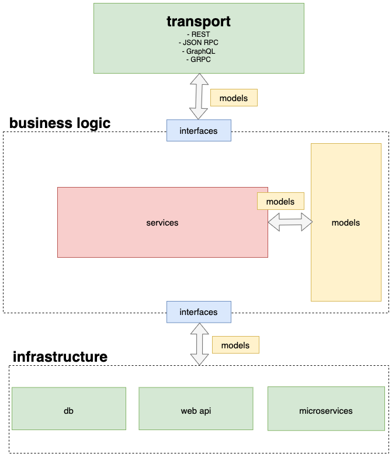

# URLAsker

### Get Started

API prefix: `/api/v1`

Service started with default interval of 5s and empty set of urls. For get service information, use `/info` handler.
For change settings use: `/setInterval` `/setUrls` `/addUrls` `/deleteUrls`. For get results of asker work: `/list`
`/listLatest`

### Quik Start

1. For build and run service
    
    ```make run```
2. For set interval

    ```request: http:/localhost/api/v1/setInterval?interval=15s```
3. For get info about asker

    ```request: http://localhost/api/v1/info```
4. For set, add, delete urls

    ```
   request: http://localhost/api/v1/setUrls or http://localhost/api/v1/addUrls or http://localhost/api/v1/deleteUrls
   body: ["https://www.google.com/", "https://yandex.com/", "https://www.yahoo.com/", "http://xydsffew.com/"]
   ```
5. For get latest result of work

   ```request: http://localhost/api/v1/listLatest```
6. For get all results between two dates

   ```
   request: http://localhost/api/v1/list?dateFrom=2022-10-28T15:28:00Z&dateTo=2022-11-01T18:28:10Z
   params: dateFrom, dateTo in RFC3339 form 
   ```

### Contracts
Project has several public contracts: [swagger](https://github.com/MikhailSolovev/URLAsker/blob/main/api/swagger.yaml),
[interfaces](https://github.com/MikhailSolovev/URLAsker/blob/main/internal/interfaces/asker.go)

### Make

`run` - build and start service

`stop` - stop service

`stop-clean-volumes` - stop service and clean persistence volumes

`restart` - make new image of asker and restart service

`test-local` - run local tests

`gen-swagger` - generate swagger file in api directory

### Code architecture


### Some thoughts
Maybe it's more convenient to use clickhouse instead postgres,
therefore clickhouse is better on aggregations, which can be useful
for future analytics.
